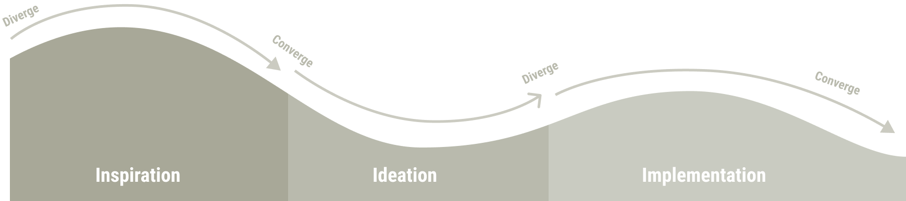
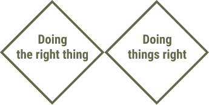
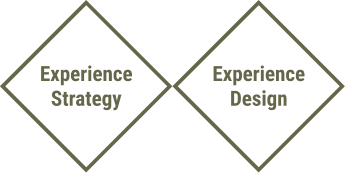

# Double Diamond

## Point departure

The core question in almost any creative or design project is how to get from point A (Don’t know or Could be) to point B (Do know or Should be). This process might seem finite and straightforward at first sight. In reality, it is a never ending process, as creativity is the habit of continually doing things in new ways to make a positive difference to our life.

The Double Diamond is a structured design approach to tackle challenges in four phases:

1. **Discover /Research** — insight into the problem (diverging)
2. **Define/Synthesis** — the area to focus upon (converging)
3. **Develop/ Ideation** — potential solutions (diverging)
4. **Deliver /Implementation** — solutions that work (converging)

Phases of this process are either diverging or converging. During a diverging phase, you try to open up as much as possible without limiting yourself, whereas a converging phase focuses on condensing and narrowing your findings or ideas.

The four phases of the Double Diamond may be simplified and merged into two main stages of the process.

- **Stage 1 Doing the right thing** - Whatever you do, you ought to look for the right problem to solve or the right question to ask before you try to do so. This is all about what you do.

- **Stage 2 Doing things right** - Once you have found the right question to answer or the right problem to solve, you want to make sure that you do this the right way. This is all about how you do it.

## Phases

### Discover (Research phase)

Understand the initial situation or challenge. Define what additional knowledge you need. Figure out how to obtain it. Interview and research.

- Rip the Brief - Analyze the initial situation and conclude how much more details and knowledge you kneed or want.
- Define your research scope, methods, prepare and plan your research.
- Conduct your primary (field) and secondary (desk) research.

**Output:** Unstructured research findings, documentation and findings.

### Define (Synthesis phase)

Understand and make sense of your research to define whether you are solving the right problem and phrase your vision accordingly.

- Lay out all your research findings and build themes and clusters go gain an overview.
- Find insights – the dormant truth behind the facts or the words between the lines.
- Deduce opportunity areas and potential fields of action.
- Form redefined “How might we” -questions based on the opportunity areas.

**Output:** A final brief, new or refined HMW-research questions or a strategy paper.

### Develop (Ideation phase)

Get into the solution mode by evaluating ways and means to solve the core issues you have deduced from your research synthesis.

- Ideate - generate as many ideas or potential solutions as possible.
- Evaluate the first ideas you want to bring into further exploration.
- Set the ideas, the design vision or your hypotheses to a point when you can make them tangible.

**Output:** A set of ideas, a strategic thesis, a concept, first design drafts, a vision or first prototypes.

### Deliver (Implementation phase)

Design, craft, develop your ideas and potential solutions into something tangible. Build, test and fail to learn and to do it again.

- Prototype, Test & Analyze (make your best ideas tangible, test them and see what you get out).
- Learn, Iterate & Repeat (bring in the learnings, maybe rethink, redo, retest).
- Build, Iterate & repeat as often as necessary (the better the results get the more you bring your product to a real-world, usable and stable product).
- Release your solution and push it out to your users.

**Output:** Your final product or the solution and answer to your original challenge.

## Diversion versus conversion

Each phase of this process either makes you diverge or converge. Diverging phases requires you to open up and take anything possible into account or develop as many ideas and potential solutions as possible. Converging phases require you to narrow down, get your ideas and approaches straight to make sense and decisions.

### Inspiration

**I have a design challenge**

- *How do I get started?*
- *How do I conduct an interview?*
- *How do I stay human-centered?*

### Ideation

**I have an opportunity for design.**

- *How do I interpret what I’ve learned?*
- *How do I turn my insights into tangible ideas?*
- *How do I make a prototype?*

### Implementation

**I have a innovation solution.**

- *How do I make my concept real?*
- *How do I assess if it’s working?*
- *How do I place for sustainability?*

## Strategy versus design

How does this framework align in an organizational context? When taking a step back, the four phases may be summarized as two main stages. Each stage aiming at a goal and resulting in an outcome, placing it in the corresponding organizational matrix.

#### Stage 1 - Experience Strategy

The first two phases - Discover & Define - are all about “doing the right thing” (goal) and finding the right question to answer or the right problem to solve. This is when we talk about establishing an experience strategy (outcome).

#### Stage 2 - Experience Design

The following two phases - Develop & Deliver - are all about doing things right (goal) and finding the right answer or the right way to solve the problem. That’s when we talk about executing the experience design (outcome).

## Stage 1 - Doing the right thing

How does this framework align in an organizational context? When taking a step back, the four phases may be summarized as two main stages. Each stage aiming at a goal and resulting in an outcome, placing it in the corresponding organizational matrix.

#### Discover and research

1. **Rip the brief** (the usual starting point of your challenge) - Try to question the brief or your initial question by challenging every part of it and evaluating fields of interests.List as many elements as you can, find characteristics, define areas of interest and extremes, list places, people (personas), experiences that are related and can be explored.

2. Before you dive into your research, **cluster your findings into topics** to get an overview and you might have to limit yourself in terms of the scope you want to research.

3. Dive into your **research**. Apply **primary** (field) and **secondary** (desk) research methods.

As a result, you ought to end up with a huge pile of unstructured research findings.

#### Define synthesis

1. **Download** (summarize your raw findings and share them with your team) all your research.

2. **Cluster learnings** and similarities to themes.

3. **Find insights** (insights are the dormant truth about the consumer’s motivations, wishes or frustrations regarding a specific topic)build opportunity areas (a phrasing of the potential area of action).


4. **Create HMW questions** (A so called “how might we...” question that makes a tangible statement of what is to be done or solved within the area of action).

As a result, you ought to come up with a revamped brief (final brief, HMW-question) that either clarifies or details the initial brief challenge or even contradicts it.

## Stage 2 - Doing things right

How does this framework align in an organizational context? When taking a step back, the four phases may be summarized as two main stages. Each stage aiming at a goal and resulting in an outcome, placing it in the corresponding organizational matrix.

#### Develop and ideation

1. **Ideation** - This is the fun part and as it is part of a diverging phase. You should restrain from limiting yourself and approach ideation with an open mind. Do not judge during ideation. Apply a “yes, and…” rather than a “no…” or “yes, but…” mentality. Let anything happen at this point and build upon each other’s ideas. There are tonnes of creative ideation tools and methods out there. I am not going into detail here.

2. **Evaluation** - Towards the end of an ideation phase, evaluate your ideas and select your favorite ones. Two tools that come in handy are dot-votings (each team member votes for ideas) or impact/feasibility matrices (a matrix that puts feasibility in relation to a potential impact of an idea).

As a result, you ought to end up with one or a small number of ideas you want to later prototype and test, in order to find the best answer or solution to your initial question or problem.

#### Deliver and implementation

Once you have come up with potential solutions, you want to evaluate the final one and the way it needs to be implemented or executed. In order to so, you may apply an agile approach consisting of three steps:

1. Build/Prototype
2. Test/Analyse
3. Iterate/Repeat

Aim for MVPs — minimum viable products/prototypes, that offer enough tangibility to find out whether they solve the initial problem or answers the initial question.

As a result, you ought to be able to go “out” with your final proposal, product, answer or solution.

